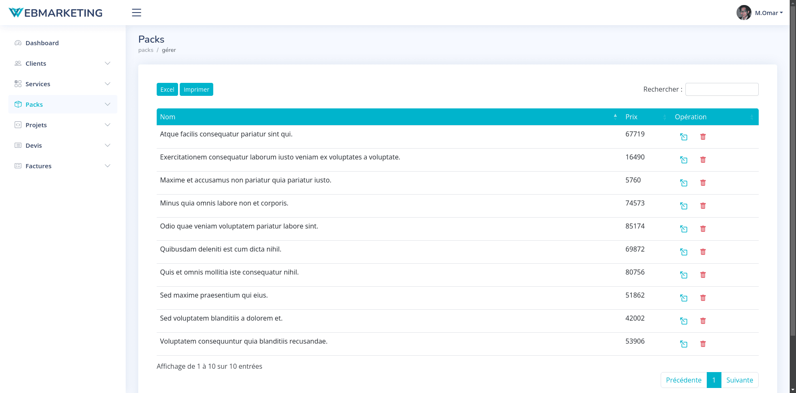
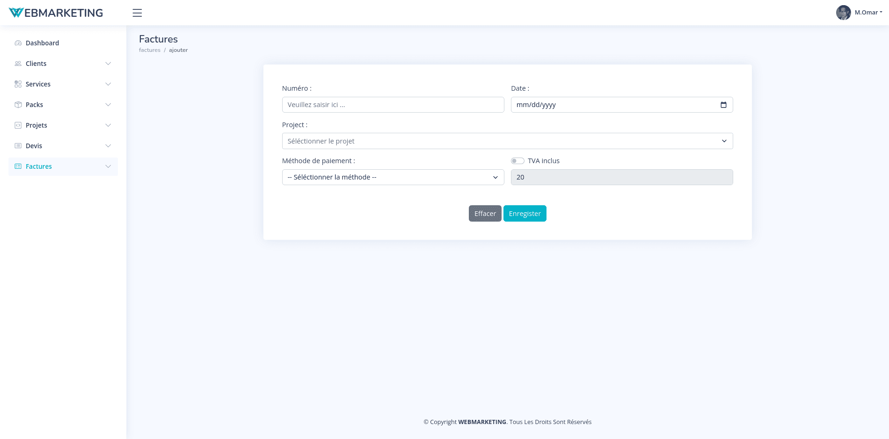
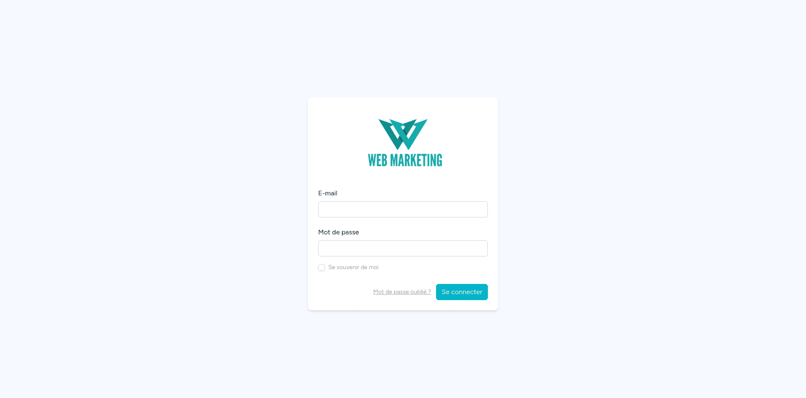
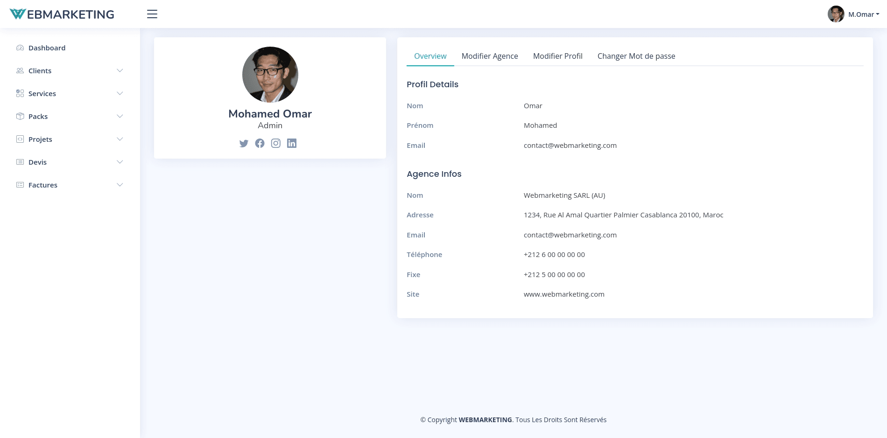

# Application Web de Gestion Commerciale

### Description

Cette application web a été développée dans le cadre d'un projet de fin d'études (PFE) par une équipe de trois étudiants pour une agence marocaine. Elle vise à moderniser et à automatiser les tâches de gestion commerciale, incluant la création de devis et factures, la gestion des clients, des services, des projets, et bien plus encore. 

L'objectif principal est d'offrir un outil intuitif, sécurisé et performant pour optimiser le temps et les ressources du gérant de l'agence.

| Dashboard Web | Dashboard Mobile |
|--------------|------------------|
|  |  |

---

## Fonctionnalités

### Gestion des Clients

| Ajouter Client | Gérer Clients |
|----------------|---------------|
|  |  |

| Modal Client Sélectionné | Modifier Client |
|-------------------------|-----------------|
|  |  |

### Gestion des Services

| Ajouter Service | Gérer Services |
|-----------------|----------------|
|  |  |

| Modal Service Sélectionné | Modifier Service |
|---------------------------|------------------|
|  |  |

### Gestion des Packs

| Ajouter Pack | Gérer Packs |
|--------------|-------------|
|  |  |

| Modal Pack Sélectionné | Modifier Pack |
|----------------------|---------------|
|  |  |

### Gestion des Projets

| Ajouter Projet | Gérer Projets |
|----------------|---------------|
|  |  |

| Modal Projet Sélectionné | Modifier Projet |
|-------------------------|-----------------|
|  |  |

### Gestion des Devis

| Ajouter Devis | Gérer Devis |
|---------------|-------------|
|  |  |

| Modal Devis Sélectionné | Modifier Devis |
|------------------------|----------------|
|  |  |

### Gestion des Factures

| Ajouter Facture | Gérer Factures |
|-----------------|----------------|
|  |  |

| Modal Facture Sélectionnée | Modifier Facture |
|---------------------------|------------------|
|  |  |

### Impression des Documents
Les documents peuvent être imprimés avec ou sans signature numérique.

Deux options d'impression sont disponibles :
- **Export PDF direct** : Génère et télécharge directement le document en PDF
- **Impression navigateur** : Utilise le mécanisme d'impression natif du navigateur web

| Imprimer Devis | Imprimer Facture |
|----------------|------------------|
|  |  |

### Login et Profil

| Page de connexion | Profil utilisateur |
|------------------|-------------------|
|  |  |

### Options des tableaux de données

| Options de DataTable |
|---------------------|
|  |

Tous les tableaux de données dans l'application disposent des fonctionnalités suivantes :
- **Recherche** : Une barre de recherche pour filtrer rapidement les données
- **Tri** : Possibilité de trier chaque colonne par ordre croissant/décroissant
- **Export** : Options d'export des données en PDF ou Excel
- **Pagination** : Navigation entre les pages avec nombre d'entrées configurable
- **Impression** : Impression directe du tableau via le navigateur

---

Les principales fonctionnalités incluent :
- **Authentification sécurisée** : Accès réservé au gérant après identification.
- **Gestion des clients** : Ajout, consultation, modification, suppression.
- **Gestion des services** : Ajout, consultation, modification, suppression.
- **Organisation en packs** : Gestion des services similaires regroupés.
- **Gestion des projets** : Création, suivi et mise à jour des projets liés à des clients et services.
- **Documents commerciaux** : Génération automatique et impression des devis et factures en PDF.
- **Statistiques** : Visualisation de l'état actuel de l'entreprise via des données analytiques.
- **Personnalisation** : Modification des informations du gérant et des paramètres de l'agence.

---

## Technologies utilisées

### Langages de programmation
- **HTML5** : Structure des pages web.
- **CSS3** : Design et mise en page.
- **JavaScript** : Fonctionnalités dynamiques et interactions utilisateur.
- **PHP 8** : Développement côté serveur.

### Frameworks et bibliothèques
- **Laravel 10** : Framework PHP pour une architecture MVC robuste.
- **Livewire** : Création d'interfaces dynamiques.
- **Bootstrap 5** : Design responsive et composants UI.
- **jQuery** : Simplification des interactions DOM.
- **Select2** : Composant de sélection avancé avec recherche.
- **DataTables** : Affichage et manipulation de tableaux de données.
- **jsPDF** : Génération de documents PDF côté client.

### Base de données
- **MySQL** : Gestion des données relationnelles.

### Outils de gestion de version
- **Git** : Gestion des versions du code source.
- **GitHub** : Collaboration et hébergement du code.

---

## Structure du projet

### Architecture
Le projet suit une architecture **MVC (Modèle-Vue-Contrôleur)** pour séparer clairement les responsabilités :
- **Modèle** : Gestion des données et logique métier.
- **Vue** : Interfaces graphiques et interactions utilisateur.
- **Contrôleur** : Coordination entre les modèles et les vues.

### Diagrammes UML
Le projet est conçu à l'aide de diagrammes UML, notamment :
- Diagramme de cas d'utilisation
- Diagramme de classes
- Diagramme de séquence

### Outils de conception
- **Enterprise Architect** : Pour la création des diagrammes UML.
- **MySQL Workbench** : Modélisation des données et gestion de la base de données.